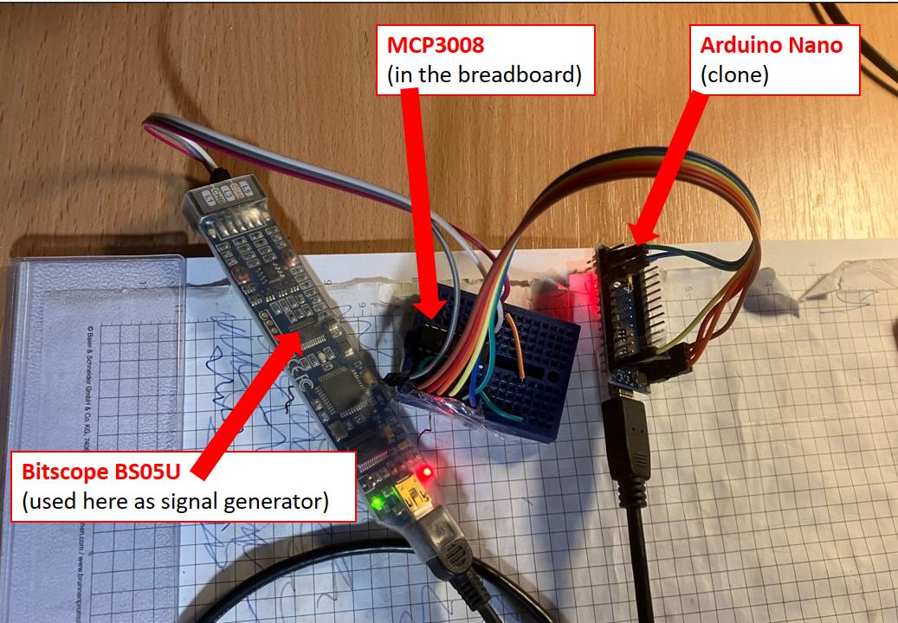
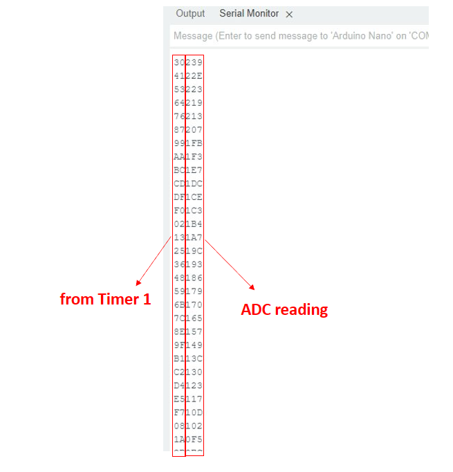
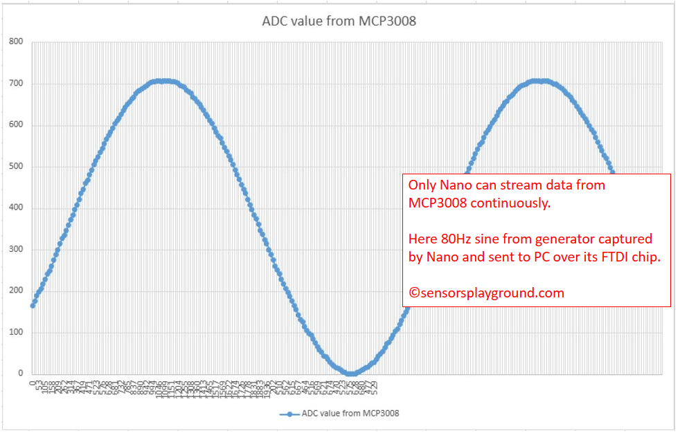
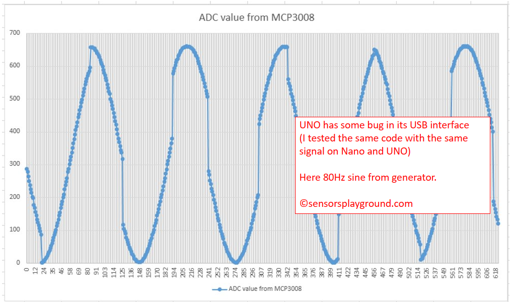

# Arduino_Nano_MPC3008_logger
uses **MCP3008** and **continuously sends data to PC at a speed ~14350 Samples/sec** 

(timestamp included ;-)



## General Introduction

This code is part of the next generation of Arduino optical vibrometer:

https://github.com/TomasGaj/Arduino_vibrometer/  

Arduino Nano is reading data over SPI from MCP300 (10-bit ADC),
Nano adds to the data the time stamp from Timer1 and it is all sent to PC with
speed of 69-70us each sample (1 sample = timestamp plus 10-bit value).

**Update 12.8.2023: It looks to me that no CRC is needed. I continue testing.**
```
How to connect Arduino Nano board and the MCP3008 (using native SPI)

MCP3008   Arduino Nano

V_DD      5V

V_REF     5V

AGND      GND

CLK       D13

D_OUT     D12

D_IN      D11

CS        D10

DGND      GND
```


**The structure of the data:**

  The first two nibbles are time-stamp from the lower byte of Timer1.

  The next three nibbles are ADC data.

  And on the end of the message are placed carriage return and new line characters.

  

## This code is following two main sources:

   I. Youtube tutorials of Anas Kuzechie: 
   [Arduino ](https://www.youtube.com/@AnasKuzechie)

   II. fast-MCP3008 library written by Dmitriy L.
   [Fast MCP3008 library for Arduino Uno](https://github.com/arithmechanics/fast-MCP3008)

## About the bug, why the code runs only on Arduino Nano

It must be due to its FTDI chip, the figures below are self-explanatory.
After uploading the code into UNO, you'll see missing data as in the figure below,
after uploading into Nano, you'll see continuous data.

When I saw it for the first time I thought it was coming from some interruption
running in the background, for example from micros(), so I moved to the C.
It was quite long for any interruption, but I had no other idea.
The problem remained and then I found this thread, I think they are talking about this issue:

[https://forum.arduino.cc/t/uno-atmega16u2-maximum-serial-throughput/893662](https://forum.arduino.cc/t/uno-atmega16u2-maximum-serial-throughput/893662)

I think it's due to the buffer overflow in the Atmega chip replacing FTDI,
maybe they already fix it in new versions, I did not investigate it.

**Update 12.8.2023: I plan to test the original Arduino MEGA 2560 bought at Farnell at the beginning of this year.**

 

 


